# nlir — natural-language IR

`nlir` transpiles a terse, sigil-laden **shorthand** into fluent **English**. The
shorthand is an intermediate representation: it is *tokenised*, *parsed* into a
DAG using a config-defined grammar, and *evaluated* over a small **stack machine**
with a **tiny type system**, where each operator is realised either
**deterministically** (mechanical string/number expansion) or via an **LLM** call
(a structured text transformation).

Typically invoked from a coding agent's prompt window:

```sh
nlir -e '#^-1'        # "the subject of the last assistant message"
```

The engine ships only a tiny set of **builtins** (stack / context / indexing /
assignment / arithmetic / coercion / list plumbing). Everything else — the
operator vocabulary, their fixity / priority / arity / types, the models, the
prompts, the coercions, the tests — lives in `~/.config/nlir/config.yaml`. **The
binary is a small VM; the language is config.**

See [`SPEC.md`](./SPEC.md) for the full normative contract; this README is the
usage-oriented tour.

## Showreel

Terse shorthand in, fluent English out. A few of the moves (deterministic outputs
are exact; LLM outputs are real `claude-sonnet-5` captures):

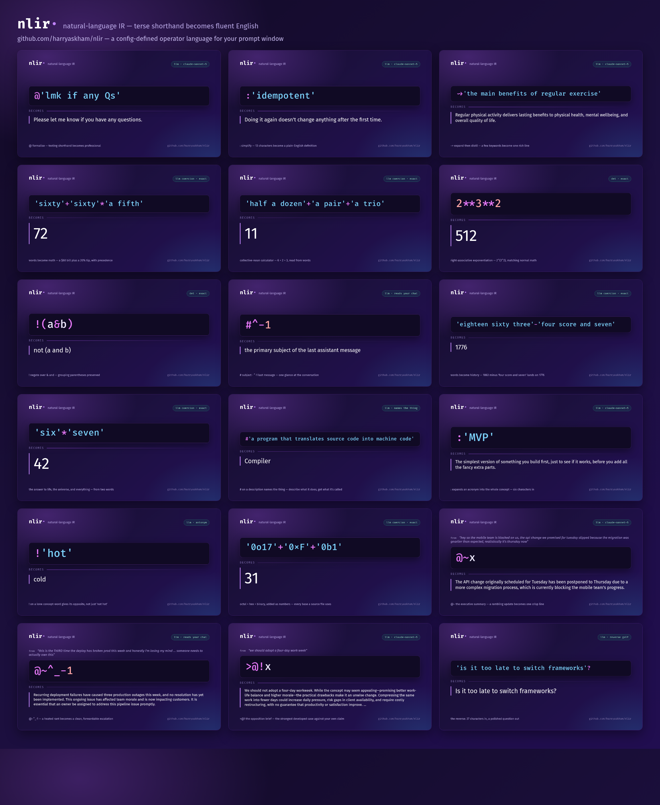

One claim, refracted along every axis of meaning — `[#x, ~x, >x, !x, @x, x?]`:

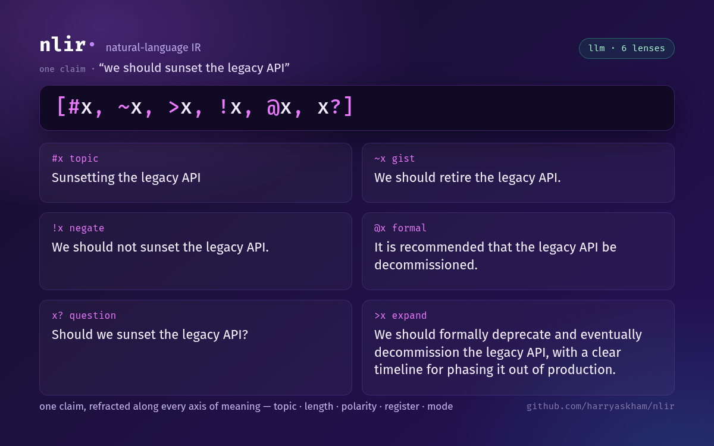

A whole *layered reply* in ONE expression — answer the agent, fold in your modification,
reference an earlier point, add a caveat, restyle it formal, then addendum a reflection on
your own summary. Six communicative moves, a handful of sigils, reading your live chat
(`^-1` their last message, `^_-1` an earlier one, `$k`/`~$k` your draft and its own gist):

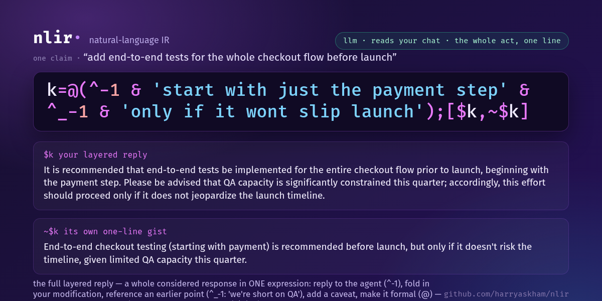

| | |
|---|---|
| 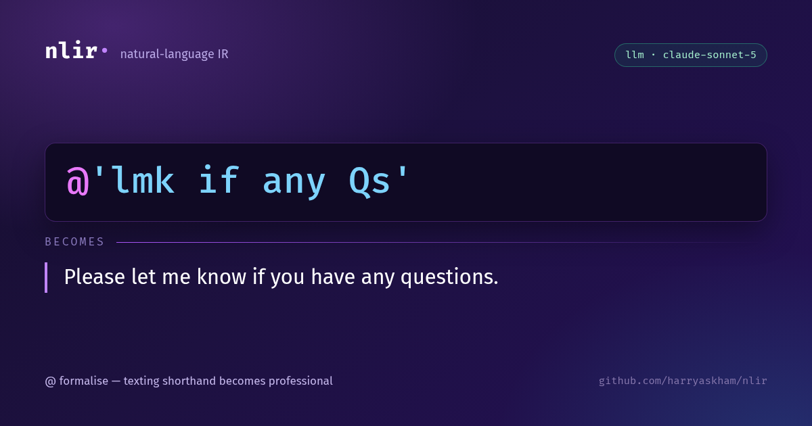 | 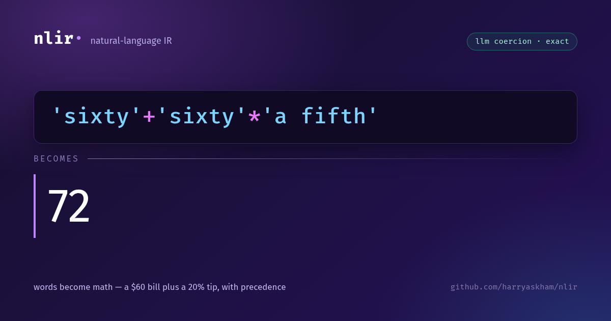 |
| `@'lmk if any Qs'` → a polished professional line | `'sixty'+'sixty'*'a fifth'` → `72` (a $60 bill + a 20% tip) |
| 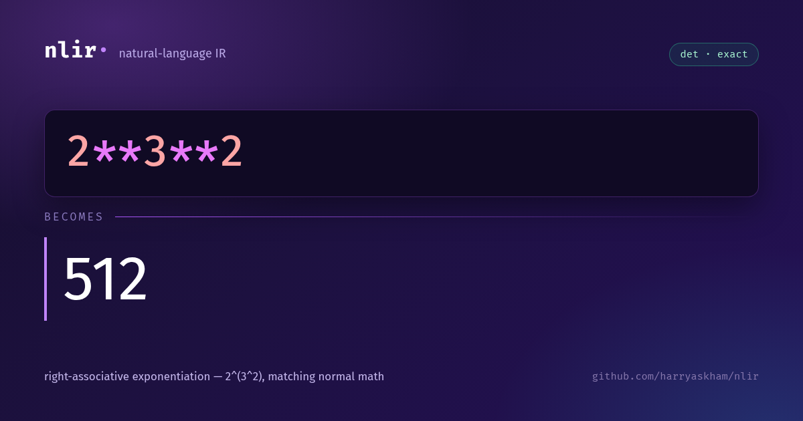 | 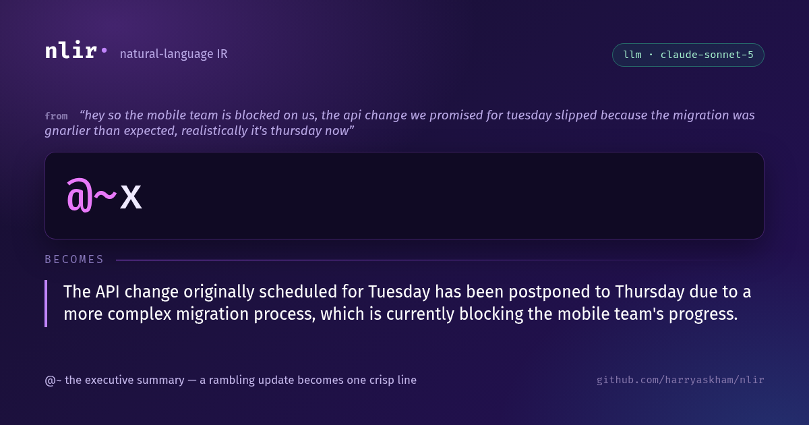 |
| `2**3**2` → `512` (exponentiation, done right) | `@~x` → a rambling update becomes one crisp line |
| 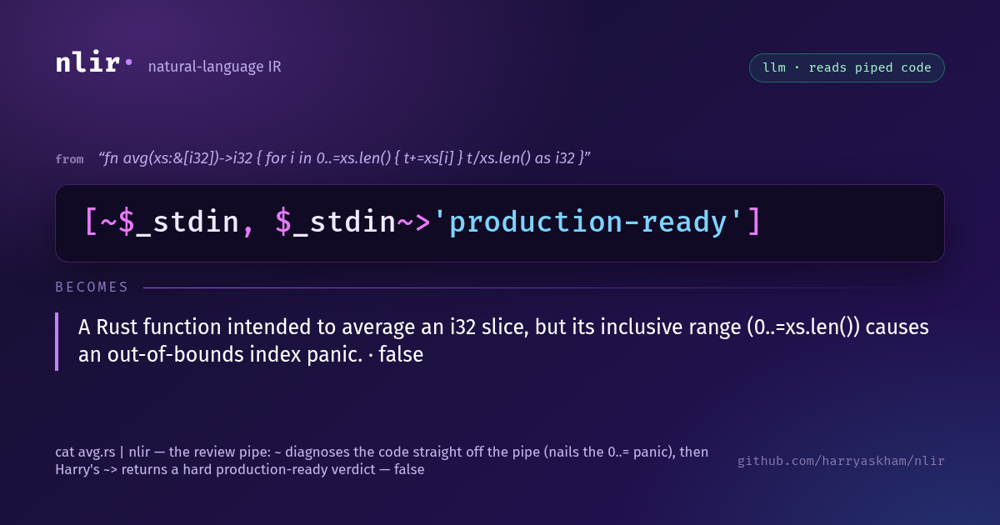 | 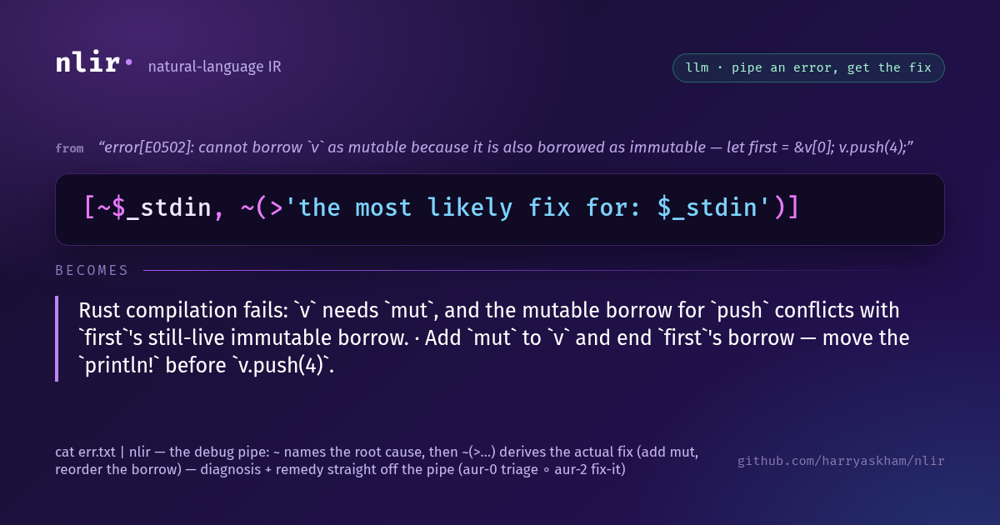 |
| `cat foo.rs \| nlir -e '[~$_stdin, $_stdin~>"production-ready"]'` → a code diagnosis + a hard verdict | `cat err.txt \| nlir -e '[~$_stdin, ~(>"fix for: $_stdin")]'` → the root cause + the actual fix |

The smart pipe distils whatever you feed it — a git diff, a compiler error, or a stack trace — all through one sigil:

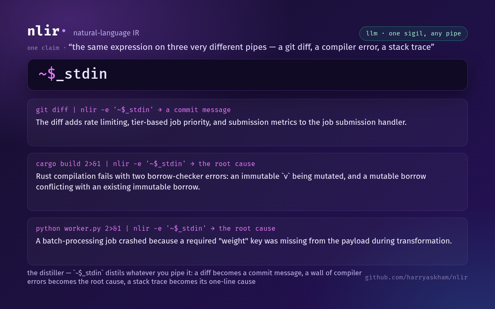

And with quoted forms, nlir is now *programmable* — quote an expression with numbered holes (`$0`, `$1`) to make a function, bind it to a name, and reuse it on any input:

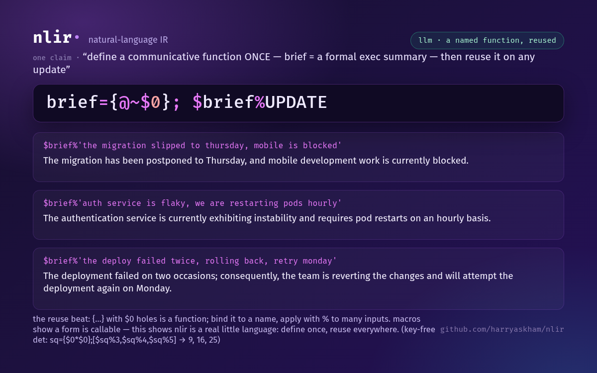

The full set lives in [`showcase/`](./showcase). Regenerate or add cards with
[`scripts/build-showcase.py`](./scripts/build-showcase.py) (headless-chromium
HTML→PNG at the 1200×630 social/OG size; pass `--scale 2` for retina):

```sh
python3 scripts/build-showcase.py --out showcase
```

## The language of thought

nlir is small enough to *speak back*. Learn a handful of moves and you can express
rich, real intent — reply to a suggestion with your amendment, close a debate with a
decision, decline something on your grounds and offer an alternative — in a few sigils,
right inside your chat with an agent.

Every move is the same shape: **`COMPOSE(TRANSFORM(SELECT))`** — **select** a slice of the
conversation, **transform** it, and optionally **compose** several into one. Three dials
steer it:

- **tone** — `@` formal · `:` plain · `~` terse
- **role** — `^_` what *you* said · `^` what the *agent* said (`^*` either · `^/` system)
- **time** — `^-1` the last turn · `0^*-1` the whole thread · `^_0` the first

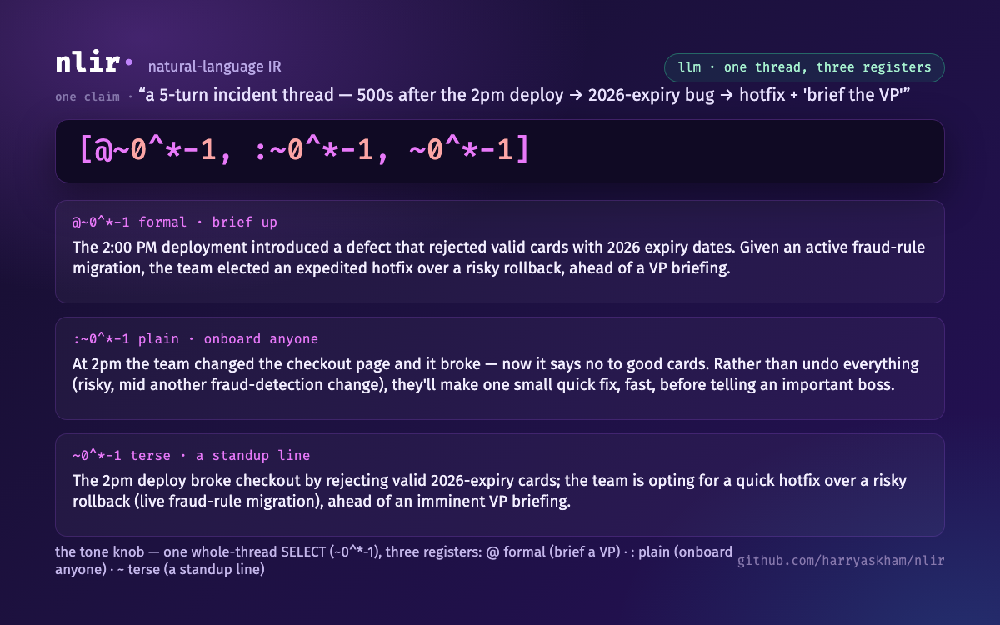

A few moves to start with:

| move | say it | what it does |
|---|---|---|
| considered reply | `@(^-1 & 'but scope it to mobile first')` | reply to an agent's suggestion, folding in your amendment, made formal |
| reasoned no | `@(!^-1 & 'it doubles our on-call')` | decline a proposal, on your grounds, professionally |
| decisive close | `@(~0^*-1 & 'decision: ship Friday')` | end a whole debate with your call, grounded in what was said |
| brain-dump | `'too many steps'; 'users drop off'; &; ~$` | jot scattered thoughts, fold them, get the one takeaway |
| theme-finder | `#['login broken', 'OAuth 500s', 'reset fails']` | fold a pile of items down to the one category they share |

The full phrasebook — every move, its shape, and a copy-paste template, across all four
lanes — lives in **[`examples/phrasebook.md`](examples/phrasebook.md)**.

And three ways to learn it live: **`nlir help`** prints every operator — sigil, name,
and what it does — derived straight from your config; **`nlir step '<expr>'`** (or
**`:step <expr>`** in the repl, pressing Tab to advance) walks an expression through
evaluation one reduction at a time, so you can watch the sigils unfold into English
step by step; and **`nlir show '<expr>'`** draws the expression's computational
**dataflow graph** — every value and operation a node, with variable bindings
resolved into edges — as SVG, a PNG (`--png`), an animated PNG of the reduction
(`--save-animation`), or live in a kitty terminal (`--kitty` / `--animate`). It uses
the same renderer as the in-browser workspace, so the terminal and the web draw
byte-identical graphs.

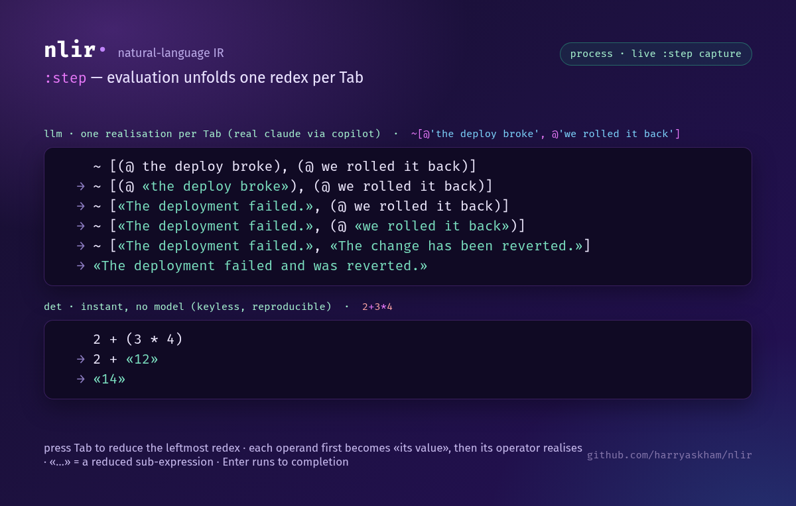

## Mental model

```
EXPR ──tokenise──▶ tokens ──parse──▶ DAG ──schedule/eval──▶ English
                             (grammar from config)   (stack machine; types + coercion; per-op det|llm; parallel)
```

- An expression is a sequence of **statements** separated by `;`.
- Evaluating a statement yields a **typed value** and pushes it onto the stack.
- **Operators** combine values; each declares the **types** it needs, and operands
  are **coerced** to those types first (deterministically, or via an LLM coercion).
- Given no operands, an operator **pops from the stack**.
- The parse is a **DAG**: independent subtrees can run concurrently.
- The **program result** is the final statement's value → stdout.

## Install / build

nlir is a Rust CLI built on the harryaskham CLI stack (`mcp-cli`,
`updatable-cli`, `feedback-cli`). On Linux, build with the **system Rust
toolchain** (no nix dev shell required — glibc provides iconv):

```sh
cargo build --release        # binary at target/release/nlir
```

On macOS, the flake dev shell provides `libiconv`:

```sh
nix develop --command cargo build --release
```

The ecosystem crate dependencies are public and fetched over https, so no tokens
or SSH keys are needed to build.

## Quick start

On first run, nlir writes a starter config to `~/.config/nlir/config.yaml`
(the shipped [`config.example.yaml`](./config.example.yaml)) if none exists, then
evaluates your expression:

```sh
# Deterministic mode needs no API key — the numeric / template / join / command
# operators run locally:
nlir --mode det -e '1+2+3'      # "6"
nlir --mode det -e 'a&b&c'      # "a and b and c"   (via the `and` operator's join)
nlir --mode det -e '!(a&b)'     # "not (a and b)"   (parens preserved)

# LLM mode calls the configured models (set ANTHROPIC_API_KEY for the `haiku`
# model in the example config):
nlir -e '#^-1'                  # extract the subject of the last assistant message
```

## The config *is* the language

`~/.config/nlir/config.yaml` defines everything. The shipped example config has
these sections (see [`config.example.yaml`](./config.example.yaml) for the full,
validated file):

| Section | What it defines |
|---|---|
| `defaults` | default `mode` (`det`/`llm`), `model`, `parallelism` |
| `models` | named model backends — `anthropic_messages` (direct HTTP) or `command` (subprocess) |
| `prompts` | reusable prompt fragments exposed as `${NLIR_*}` env vars |
| `operators` | the operator vocabulary: `op` sigil, `arity`, `fixity`, `priority`, operand/result `types`, and a realisation (`template` / `join` / `command` / `reduce` for `det`, or `model` + `prompt` for `llm`) |
| `types` | coercion targets — how to interpret text as `number` / `bool` / … (deterministic parse first, LLM fallback) |
| `context` | the `context.json` store, `_messages` role views (`^`), and system-key defaults (`_sep`, `_cache`) |
| `sessions` | how to read external session files (e.g. a Pi session) as context |
| `tests` | `nlir test` cases: `{ mode, expr, expected }` |

A minimal operator, for example:

```yaml
operators:
  and: { op: "&", arity: ">0", fixity: mixfix, join: " and ", model: sonnet,
         prompt: "Combine the <text> items with an \"and\" connective ...\n\n%" }
  add: { op: "+", arity: ">0", fixity: mixfix, operands: number, result: number, reduce: add }
```

`&` joins its operands with `" and "` in `det` mode, or asks the `sonnet` model to
combine them in `llm` mode. `+` is always deterministic (`reduce: add`).

## Modes

- **`det`** (no network): realise via `command:` / `reduce:` / `template:` /
  `join:` only.
- **`llm`**: string transformations go to `model:` + `prompt:`; `command` / `reduce`
  and coercion math stay deterministic regardless of mode.

Default from `defaults.mode`; override per run with `--mode det|llm`.

## Types & coercion

Every value is one of `string` (default), `number`, `bool`, or `list`. Before an
operator runs, each operand is coerced to the required type:

1. already that type → used as-is;
2. **deterministic** parse — `"1"` ↔ `1`, `number`/`bool`/`list` → `string`
   (lists join with `_sep`), `"true"` → `bool`;
3. else an **LLM coercion** — "interpret this text as a value of type T" with a
   `{result: T}` schema, configured per type under `types:`. This turns a vague
   `"ten to twenty"` into `15`.

A coercion that cannot produce the target type is a loud error; `list → number`
is always an error.

## Forms & application — the programmable core

A `{…}` **form** is a quoted expression: `{2+3}` yields the expression *as data*
(`{(2 + 3)}`), not its value — quoting is **inert**. Forms are first-class
values: bind one to a name, pass it around, and **apply** it with `%`, binding
arguments positionally to the holes `$0`, `$1`, …:

```sh
nlir -e '{2+3}'               # → {(2 + 3)}   (a form — code as data, not run)
nlir -e '{$0+1}%5'            # → 6           (apply a form to an argument)
nlir -e '{$0+$1}%(2,3)'       # → 5           (tuple args; %(2,3) ≡ %[2,3])
nlir -e 'sq={$0*$0};$sq%5'    # → 25          (a named lambda: bind, then apply)
nlir -e '({$0+1}_3)%5'        # → 8           (do-N-times: compose a form N times)
```

The argument frame is **hygienic** — a form's `$0` is its argument, not whatever
is on the run stack (`9;{$0}%7` → `7`). Application binds tighter than `,` (pass a
tuple with `%(a,b)`) and tighter than `_` (parenthesise the compose: `({form}_N)%x`).
A **macro** is just a form whose body is a transform, applied to text, so the same
quote+apply machinery gives you reusable moves. Together — quoted forms,
application, named lambdas/macros, and do-N-times — these are the programmable
layer map/fold over forms builds on.

**Build something with them:** the [cookbook](docs/cookbook.md) is a worked
catalogue of multi-layer programs — named functions, composition, nesting, and
do-N chains — every deterministic output verified end-to-end.

## The composable core — adverbs, trains, basics

Forms unlock a small **composable core**: a handful of primitives that compose
into real programs (APL/J-style), rather than a built-in function for every task.

**The adverb family** — higher-order builtins applied with `%`, taking a form and
a list (lists render separator-joined; shown here as `[…]` for clarity):

```sh
nlir -e '$map%({$0*$0},[1,2,3])'                     # [1,4,9]      transform each
nlir -e '$fold%({$0+$1},[1,2,3,4])'                  # → 10         reduce
nlir -e '$scan%({$0+$1},[1,2,3,4])'                  # [1,3,6,10]   running fold
nlir -e '$filter%({$0>=5},[3,7,2,9])'                # [7,9]        keep-if
```

**Basics** — `$if` (branch), `$nth` (index; negatives count from the end),
`$sort`, and comparison `== != <= >=` (deterministic, `→ Bool`):

```sh
nlir -e '$sort%[3,1,2]'                               # [1,2,3]
nlir -e '$nth%(-1,$sort%[3,1,2])'                     # → 3          max, composed from sort+index
nlir -e '$if%(3<=5,"yes","no")'                       # → yes
nlir -e '$fold%({$0+$1},$map%({$0>=5},[3,7,2,9]))'   # → 2          count how many ≥5, no loop
```

**Trains** — a parenthesised group of *operators* (no operands) is a **tacit**
(point-free) composition, no `$0` spelled: an all-prefix group composes (*atop*),
and a prefix–infix–prefix group is a **fork** — two lenses on one input:

```sh
nlir -e "(~ @)%'hey can u take a look thx'"           # atop: distil∘formal → a polished ask
nlir -e "(# & ~)%'the login page is broken'"         # fork: subject & gist, in one pass
```

Mix in the LLM lenses and the core becomes a language for **algorithms on
meaning**: `$if%('prod is down'~>'an incident','page on-call','all clear')` routes
by an AI judgment with deterministic control flow. See
[composable-core.md](docs/design/composable-core.md) for the full design.

## CLI surface

```sh
nlir -e 'EXPR' [--quiet] [--mode det|llm] [--model haiku] [--parallelism N] [--dry-run]

# context read (precedence: --context-file › --session-file › NLIR_CONTEXT env › default file)
nlir … --context-file PATH
nlir … --session-file PATH        # e.g. a Pi session: roles kept, tool calls dropped

# context write (immediate; set = key replacement)
nlir set KEY VALUE
nlir set '{"k":"v","_messages":[…]}'
nlir get KEY
nlir append-message [--role user] "text"

# interactive REPL (one expr per submission; trailing `\` continues; :cmd == nlir cmd)
# on a TTY: command history (persisted to ~/.config/nlir/repl_history.txt), arrow-key
# line editing (Ctrl-A/Ctrl-E, ↑/↓ history), Ctrl-C cancels a line, Ctrl-D exits.
nlir repl [--context-file F] [--raw]

# computational dataflow graph (the AST with variable bindings resolved into edges)
nlir show 'EXPR'                          # print the graph as SVG (in a kitty terminal: the image)
nlir show 'EXPR' --png g.png              # rasterise the graph to a PNG
nlir show 'EXPR' --frames DIR             # one graph SVG per evaluation step
nlir show 'EXPR' --save-animation g.apng  # animated PNG of the step-by-step reduction
nlir show 'EXPR' --kitty                  # force the in-terminal kitty display (e.g. through tmux)
nlir show 'EXPR' --animate --kitty        # live kitty animation of the reduction

# plumbing
nlir parse 'EXPR'     # tokenise / inspect the parse
nlir test             # run the config `tests:` cases
nlir mcp stdio        # expose the surface as an MCP server (mcp-cli)
nlir self-update …    # updatable-cli
nlir feedback …       # feedback-cli
```

## Worked examples

These are the deterministic `tests:` from the example config (run with
`nlir test`):

| Expression | Result |
|---|---|
| `1+2+3` | `6` |
| `(1+1)**3` | `8` |
| `a&b&c` | `a and b and c` |
| `!(a&b)` | `not (a and b)` |
| `'one two'` | `one two` |
| `_sep=\ ;[a,b]` | `a b` |
| `k=foo;$k` | `foo` |
| `^-1` (with `_messages`) | the last assistant message |

## Sessions

Expressions can read prior conversation from `_messages`: `^-1` is the last
message (the assistant channel), and `$name` reads a context key. Point nlir at
an existing transcript with `--session-file` (a Pi session's roles are kept and
tool-call turns dropped), or accumulate turns yourself with `append-message`.

`scripts/pi-dropin.sh` is a Pi drop-in filter over a shared context: a line
beginning with `|` is expanded as an nlir expression, and every other turn is
appended to `_messages`, so later `|` expansions can read the conversation.

```sh
printf '%s\n' 'the answer is 42' '|^-1' \
  | NLIR=./target/debug/nlir scripts/pi-dropin.sh --role assistant
# → the answer is 42        (the `|^-1` expression read the appended turn)
```

## Pi package

nlir ships a [pi](https://github.com/earendil-works/pi) package so you can expand
nlir shorthand inline while chatting. Install it into pi:

```json
{ "packages": ["git:github.com/harryaskham/nlir"] }
```

(in `~/.pi/agent/settings.json`) or `pi install git:github.com/harryaskham/nlir`.
It requires the `nlir` binary on your PATH (build/install separately; set `$NLIR`
to override the path).

- **`|EXPR`** — prefix a message with `|` and the rest is expanded as an nlir
  expression before it reaches the model: `|1+2*3` → `7`, `|a&b&c` → `a and b and
  c`, `|@'the meeting is at 3'` → a formal rewrite (llm mode).
- **`/nlir EXPR`** — preview an expansion inline without sending it.

The expression evaluates against your `~/.config/nlir/config.yaml` (det or llm
mode per your defaults). The extension is `extensions/nlir.js`.

## Development

```sh
cargo test --all                      # unit + integration tests
cargo clippy --all-targets -- -D warnings
cargo fmt --all --check
```

CI (`.github/workflows/ci.yml`) runs fmt, clippy (deny-warnings), build, and test
on every push/PR; a `v*` tag triggers `.github/workflows/release.yml` to build and
publish per-target binaries. Both use the system Rust toolchain.

`.github/workflows/pages.yml` builds the docs site (`scripts/build-docs.sh` renders
this README + `SPEC.md` to HTML with pandoc) and publishes it to GitHub Pages on
push to `main`. Build it locally with `scripts/build-docs.sh ./site`.
